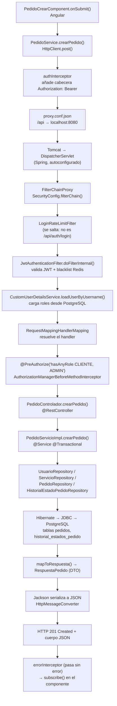

# GA — Práctica en clase: Trazado del flujo completo de una petición MVC

**Estudiante:** Johan Carvajal
**PFC:** ARTISYNC — Plataforma de comisiones de arte digital
**Repositorio del PFC:** https://github.com/JohanCarvajal04/Proyecto-WEB-ARTISYNC
**Universidad Técnica Estatal de Quevedo (UTEQ)**
**Fecha:** agosto 2026

---

## 1. Objetivo de la práctica

Seguir, dentro del proyecto propio del PFC, el recorrido completo de una petición HTTP
desde el cliente Angular hasta la respuesta JSON, e **identificar las clases Java reales**
donde ocurre cada paso del flujo:

```
Petición HTTP → DispatcherServlet → HandlerMapping → filtros de Spring Security
→ @RestController → @Service → JpaRepository → PostgreSQL
→ serialización JSON → respuesta HTTP
```

> Según la directriz (4), la práctica **no se entrega como informe**: cada estudiante
> documenta en su cuaderno o editor de texto el archivo y el método donde ocurre cada paso.
> Este repositorio es esa bitácora en formato digital.

---

## 2. Stack real del PFC

| Capa | Tecnología |
|---|---|
| Cliente | Angular 20 (standalone, zoneless), `HttpClient` con interceptores funcionales |
| Servidor | Spring Boot 4.1.0, Java 21, Spring MVC (`spring-boot-starter-webmvc`) |
| Seguridad | Spring Security 6 + JWT propio (`JwtAuthenticationFilter`) + Redis (blacklist de JTI) |
| Persistencia | Spring Data JPA / Hibernate + Flyway |
| Base de datos | PostgreSQL 16 (`artisyncbd`) |
| Serialización | Jackson (`MappingJackson2HttpMessageConverter`) |
| Puerto backend | `8080` — Angular usa `proxy.conf.json` para redirigir `/api` |

Paquete base del backend: `uteq.edu.ec.artisync`
Ruta física: `artisync/Backend/src/main/java/uteq/edu/ec/artisync/`

---

## 3. Petición elegida para el trazado

**`POST /api/v1/pedidos`** — creación de un pedido (comisión de arte) por parte de un cliente autenticado.

Se eligió esta petición porque atraviesa **todas** las capas del flujo pedido en la práctica:
es autenticada (pasa por el filtro JWT), autorizada por rol (`@PreAuthorize`), valida el
cuerpo con Bean Validation, ejecuta reglas de negocio, escribe en dos tablas de PostgreSQL
dentro de una transacción y devuelve un DTO serializado a JSON con estado `201 Created`.

---

## 4. Contenido de la bitácora

| Documento | Descripción |
|---|---|
| **[docs/00-tabla-y-preguntas.md](docs/00-tabla-y-preguntas.md)** | ⭐ **El entregable real**: la tabla de trazado de 9 pasos (Parte 2) y las 5 preguntas de análisis respondidas (Parte 3) |
| [docs/01-trazado-flujo-mvc.md](docs/01-trazado-flujo-mvc.md) | *(material extra)* Trazado paso a paso con el código real de cada capa |
| [docs/02-breakpoints-intellij.md](docs/02-breakpoints-intellij.md) | *(material extra)* Dónde colocar los puntos de ruptura en IntelliJ IDEA y qué inspeccionar en cada uno |
| [docs/03-bitacora-trazado.md](docs/03-bitacora-trazado.md) | *(material extra)* Tabla ampliada de 25 pasos: archivo Java + método + línea de cada paso (entregable del punto 4) |
| [docs/04-anexo-flujo-login.md](docs/04-anexo-flujo-login.md) | *(material extra)* Anexo: flujo de `POST /api/auth/login`, la petición pública que *genera* el JWT |

---

## 5. Diagrama del flujo



---

## 6. Cómo reproducir el trazado

1. Levantar la infraestructura (PostgreSQL + Redis) desde la raíz del PFC:

```bash
docker compose up -d db redis
```

2. Abrir `artisync/Backend` en IntelliJ IDEA y ejecutar `ArtisyncApplication` en **modo Debug**
   (`Shift + F9`), con las variables de entorno `JWT_SECRET`, `DB_URL`, `DB_APP_USER`, `DB_APP_PASSWORD`.

3. Levantar el frontend:

```bash
cd artisync/Frontend && npm start
```

4. Colocar los puntos de ruptura indicados en [docs/02-breakpoints-intellij.md](docs/02-breakpoints-intellij.md).

5. Iniciar sesión en `http://localhost:4200` con un usuario de rol `CLIENTE` y enviar el
   formulario de creación de pedido. El depurador se detendrá en cada capa.

---

## 7. Conclusión de la práctica

El trazado confirma que en ARTISYNC **ninguna capa se salta**: la petición sólo llega al
`@RestController` después de que `JwtAuthenticationFilter` haya poblado el `SecurityContext`,
y sólo entra al método después de que `@PreAuthorize` haya comprobado el rol. La regla de
negocio (un creador no puede pedirse su propio servicio) vive en el `@Service`, no en el
controlador, y la escritura en las dos tablas ocurre dentro de una única transacción
`@Transactional`. La respuesta nunca expone la entidad JPA: se convierte a `RespuestaPedido`
antes de que Jackson la serialice, lo que evita filtrar el hash de contraseña del usuario
y los problemas de *lazy loading* fuera de la sesión de Hibernate
(`spring.jpa.open-in-view=false`).
