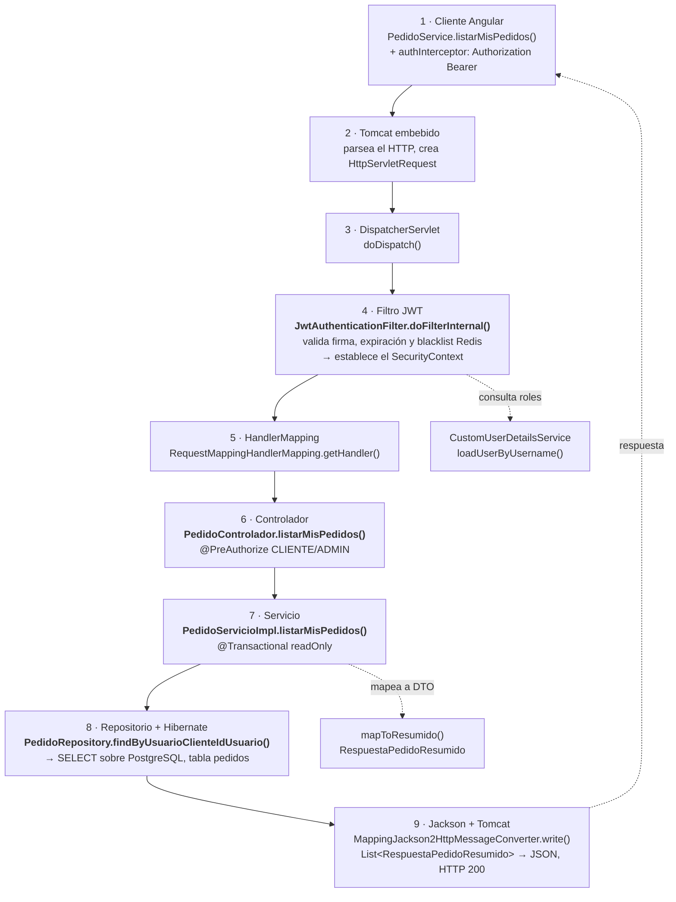

# GA — Práctica en clase: Trazado del flujo completo de una petición MVC

**Estudiante:** Johan Carvajal
**PFC:** ARTISYNC — Plataforma de comisiones de arte digital
**Repositorio del PFC:** https://github.com/JohanCarvajal04/Proyecto-WEB-ARTISYNC
**Universidad Técnica Estatal de Quevedo (UTEQ)**
**Fecha:** agosto 2026

---

## 1. Objetivo de la práctica

Seguir, dentro del proyecto propio del PFC, el recorrido completo de una petición HTTP
desde el cliente Angular hasta la respuesta JSON, e **identificar las clases Java reales**
donde ocurre cada paso del flujo:

```
Petición HTTP → DispatcherServlet → HandlerMapping → filtros de Spring Security
→ @RestController → @Service → JpaRepository → PostgreSQL
→ serialización JSON → respuesta HTTP
```

> **Entregable oficial: ninguno.** El PDF indica *"documentar en cuaderno o editor de texto
> durante la clase"*. Este repositorio es esa documentación en formato digital.

### Estructura del PDF y dónde se cubre cada parte

| Parte del PDF | Qué pide | Dónde está |
|---|---|---|
| **Parte 1** | Observar el flujo con el depurador de IntelliJ (actividad presencial) | [docs/02-breakpoints-intellij.md](docs/02-breakpoints-intellij.md) |
| **Parte 2** | *"Instrucción principal de la clase"*: completar la tabla de trazado de 9 pasos con clase, método y paquete reales | [docs/00-tabla-y-preguntas.md](docs/00-tabla-y-preguntas.md#parte-2--tabla-de-trazado-de-flujo) |
| **Parte 3** | Responder 5 preguntas de análisis | [docs/00-tabla-y-preguntas.md](docs/00-tabla-y-preguntas.md#parte-3--preguntas-de-análisis) |
| *(Tarea siguiente)* | Diagrama de secuencia UML en `/docs/diagramas/flujo-mvc-springboot.png` | **No incluido — es otra entrega**, fuera del alcance de esta práctica |

---

## 2. Stack real del PFC

| Capa | Tecnología |
|---|---|
| Cliente | Angular 20 (standalone, zoneless), `HttpClient` con interceptores funcionales |
| Servidor | Spring Boot 4.1.0, Java 21, Spring MVC (`spring-boot-starter-webmvc`) |
| Seguridad | Spring Security 6 + JWT propio (`JwtAuthenticationFilter`) + Redis (blacklist de JTI) |
| Persistencia | Spring Data JPA / Hibernate + Flyway |
| Base de datos | PostgreSQL 16 (`artisyncbd`) |
| Serialización | Jackson (`MappingJackson2HttpMessageConverter`) |
| Puerto backend | `8080` — Angular usa `proxy.conf.json` para redirigir `/api` |

Paquete base del backend: `uteq.edu.ec.artisync`
Ruta física: `artisync/Backend/src/main/java/uteq/edu/ec/artisync/`

---

## 3. Peticiones trazadas

Se trazaron **dos** peticiones del PFC. Ambas recorren las mismas cinco clases propias
(`JwtAuthenticationFilter` → `PedidoControlador` → `PedidoServicioImpl` → `PedidoRepository` →
`Pedido`); sólo cambia el método invocado en cada una.

| | Petición | Por qué | Documento |
|---|---|---|---|
| **Principal** | **`GET /api/v1/pedidos/mis-pedidos`** | Es el **listado autenticado** equivalente al `GET /api/v1/productos` del ejemplo del docente. Es la que responde la tabla de la Parte 2 y la pregunta 5 (SQL de listado) | [docs/00](docs/00-tabla-y-preguntas.md) |
| *Extra* | `POST /api/v1/pedidos` | Añade lo que un GET no muestra: `@Valid` con Bean Validation, reglas de negocio y dos `INSERT` en una sola transacción | [docs/01](docs/01-trazado-flujo-mvc.md) |

> Si sólo vas a leer un archivo, lee **[docs/00-tabla-y-preguntas.md](docs/00-tabla-y-preguntas.md)**:
> ahí está lo que el PDF pide. Los demás documentos son profundización voluntaria.

---

## 4. Contenido de la bitácora

| Documento | Descripción |
|---|---|
| **[docs/00-tabla-y-preguntas.md](docs/00-tabla-y-preguntas.md)** | ⭐ **El entregable real**: la tabla de trazado de 9 pasos (Parte 2) y las 5 preguntas de análisis respondidas (Parte 3) |
| [docs/01-trazado-flujo-mvc.md](docs/01-trazado-flujo-mvc.md) | *(material extra)* Trazado paso a paso con el código real de cada capa |
| [docs/02-breakpoints-intellij.md](docs/02-breakpoints-intellij.md) | *(material extra)* Dónde colocar los puntos de ruptura en IntelliJ IDEA y qué inspeccionar en cada uno |
| [docs/03-bitacora-trazado.md](docs/03-bitacora-trazado.md) | *(material extra)* Tabla ampliada de 25 pasos: archivo Java + método + línea de cada paso |
| [docs/04-anexo-flujo-login.md](docs/04-anexo-flujo-login.md) | *(material extra)* Anexo: flujo de `POST /api/auth/login`, la petición pública que *genera* el JWT |

---

## 5. Diagrama de los 9 pasos

Corresponde a `GET /api/v1/pedidos/mis-pedidos` y sigue la numeración exacta del PDF.
En **negrita**, los cuatro pasos que el documento pide completar con clases propias.



> El diagrama del flujo de escritura (`POST /api/v1/pedidos`, con transacción y doble INSERT)
> está en [docs/01-trazado-flujo-mvc.md](docs/01-trazado-flujo-mvc.md).

---

## 6. Cómo reproducir el trazado

1. Levantar la infraestructura (PostgreSQL + Redis) desde la raíz del PFC:

```bash
docker compose up -d db redis
```

2. Abrir `artisync/Backend` en IntelliJ IDEA y ejecutar `ArtisyncApplication` en **modo Debug**
   (`Shift + F9`), con las variables de entorno `JWT_SECRET`, `DB_URL`, `DB_APP_USER`, `DB_APP_PASSWORD`.

3. Comprobar que el servidor está listo (como indica el PDF):
   `http://localhost:8080/actuator/health` debe devolver `{"status":"UP"}`.

4. Activar el log de SQL. El PDF lo explica para `application.yml`; **ARTISYNC usa
   `application.properties`**, así que las líneas equivalentes son:

```properties
spring.jpa.show-sql=true
spring.jpa.properties.hibernate.format_sql=true
logging.level.org.hibernate.SQL=DEBUG
```

5. Colocar los puntos de ruptura indicados en [docs/02-breakpoints-intellij.md](docs/02-breakpoints-intellij.md).

6. Disparar la petición. Dos opciones:

   - **Con Postman** (el método del PDF): `POST /api/auth/login` para obtener el `accessToken`,
     y luego `GET http://localhost:8080/api/v1/pedidos/mis-pedidos` con la cabecera
     `Authorization: Bearer <token>`.
   - **Desde el frontend**: `cd artisync/Frontend && npm start`, iniciar sesión en
     `http://localhost:4200` con un usuario de rol `CLIENTE` y abrir la pantalla de pedidos.

El depurador se detendrá en cada capa.

---

## 7. Conclusión de la práctica

El trazado confirma que en ARTISYNC **ninguna capa se salta**: la petición sólo llega al
`@RestController` después de que `JwtAuthenticationFilter` haya poblado el `SecurityContext`,
y sólo entra al método después de que `@PreAuthorize` haya comprobado el rol. La lógica de
negocio vive en el `@Service`, no en el controlador, y la respuesta nunca expone la entidad
JPA: se convierte a un DTO antes de que Jackson la serialice, lo que evita filtrar el
`contrasenaHash` del `Usuario` y los problemas de *lazy loading* fuera de la sesión de
Hibernate (`spring.jpa.open-in-view=false`).

Tres cosas que sólo se vieron gracias al depurador:

1. **La seguridad es anterior a Spring MVC.** En el panel Frames, dentro del filtro JWT,
   todavía no aparece `DispatcherServlet.doDispatch()`. Una petición sin token puede morir
   sin que Spring MVC llegue a saber que existió.

2. **Quien devuelve el `401` no es el filtro JWT.** Sin cabecera `Authorization`, el filtro
   deja pasar la petición; el corte lo hace `AuthorizationFilter` y la respuesta la escribe
   `CustomAuthenticationEntryPoint.commence()`. Detalle contraintuitivo hasta verlo en vivo.

3. **Hallazgo de rendimiento: el listado tiene un N+1.** `mapToResumido()` navega
   `getServicio().getPerfil().getUsuario()` y llama `obtenerEtapaActual()` una vez por pedido.
   Con 20 pedidos en la lista son ~81 consultas en lugar de 1. Se corrige con `join fetch` o
   una proyección en `PedidoRepository`. Ver la pregunta 5 de
   [docs/00](docs/00-tabla-y-preguntas.md#pregunta-5).
